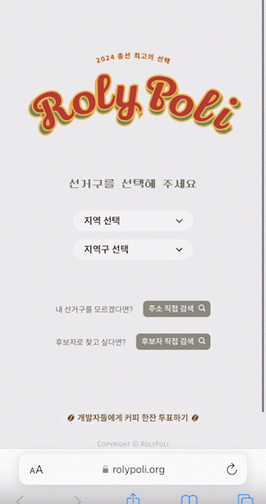
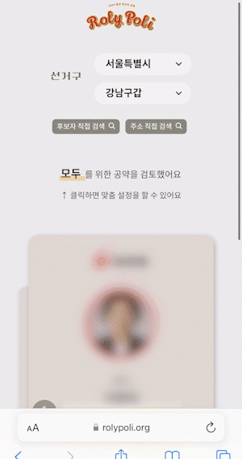
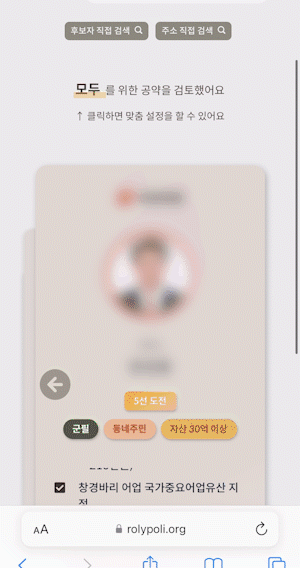
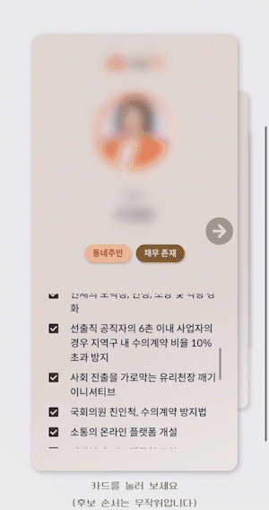
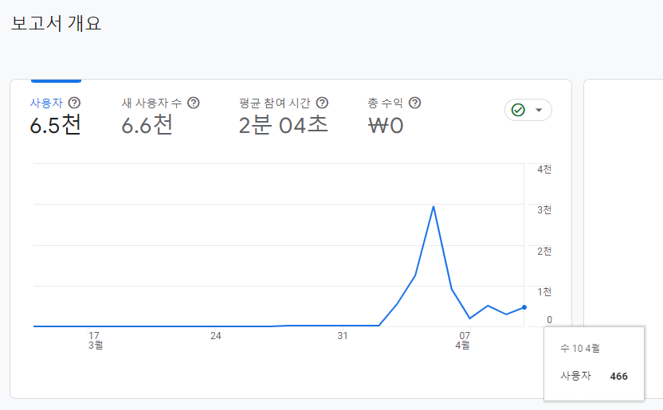

<p align="center">
    
</p>

<br />

<p align="center">
         
</p>
<br />

# <center>RolyPoli  | 2024 총선 최고의 선택</center>

※ 이하 모든 설명 및 소개 자료는 최대한 프로젝트를 잘 설명하기 위한 것일 뿐, 그 어떠한 정치적 의도나 목적이 없음을 미리 밝힙니다.

<br />

## 프로젝트 개요

```
2024년 제22대 총선 후보자에 대한 다양한 정보를 알기 쉽게 제공하는
웹서비스 제작 프로젝트
```

- https://rolypoli.org

- 실서비스 기간 : `2024년 4월 2일 ~ 2024년 4월 10일`

<br />


## 서비스 소개 자료

- <a href="https://youtu.be/sIq2ZhNf2Uo" style="color: green; font-weight: bold">RolyPoli 시연 영상</a>

<br />


## RolyPoli 구성
### Feature

1. 다양한 검색 기능
    <p align="center">
        
        
        
    </p>

    - 선거구로 후보자 찾기

    - 지역 검색으로 후보자 찾기

    - 이름 검색으로 후보자 찾기


2. 맞춤 설정으로 공약 보기
    <p align="center">
        
    </p>

    - 후보자의 공약을 내가 설정한 나이와 연령대에 맞춰 보여 드립니다.


3. 한눈에 파악하는 후보자
    <p align="center">
        
        
    </p>

    - 다양한 배지로 카드만 보고도 후보자의 주요 정보를 쉽게 파악할 수 있습니다.

    - 한 곳에 후보자 관련 정보를 모아 놓아 쉽고 편하게 정보를 보실 수 있습니다.

    - 후보자 상세 정보로 후보자의 관심 분야, 후보자의 주요 이력, 후보자의 공약, 후보자가 발의한 법안 등을 제공합니다.

### GitHub Repository

- Backend

- Frontend

- Data & Model

<br />


## RolyPoli 결과

<p align="center">
    
</p>

- 서비스 제공 기간 동안, 총 `6,500여 명`의 사람들이 RolyPoli(롤리폴리)를 이용했습니다(구글 애널리틱스 결과)

<br />
